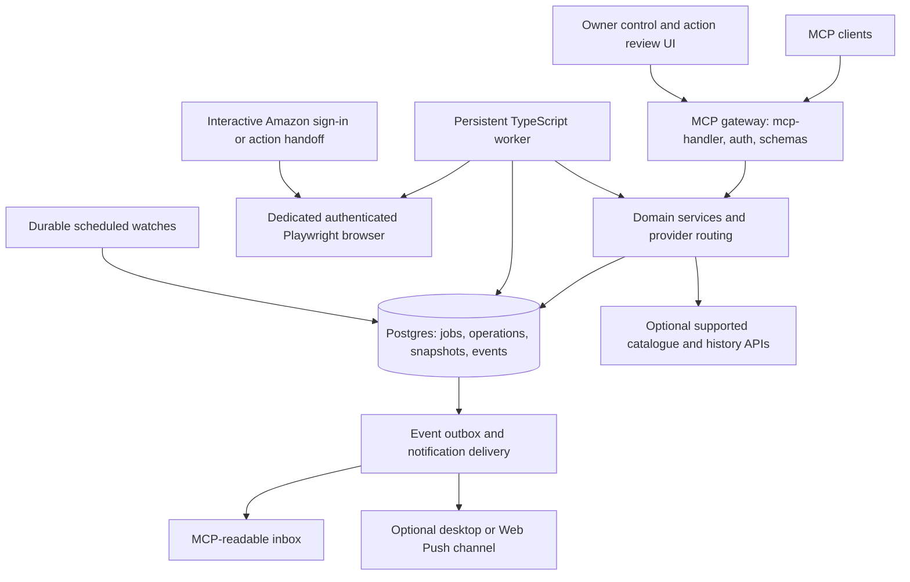
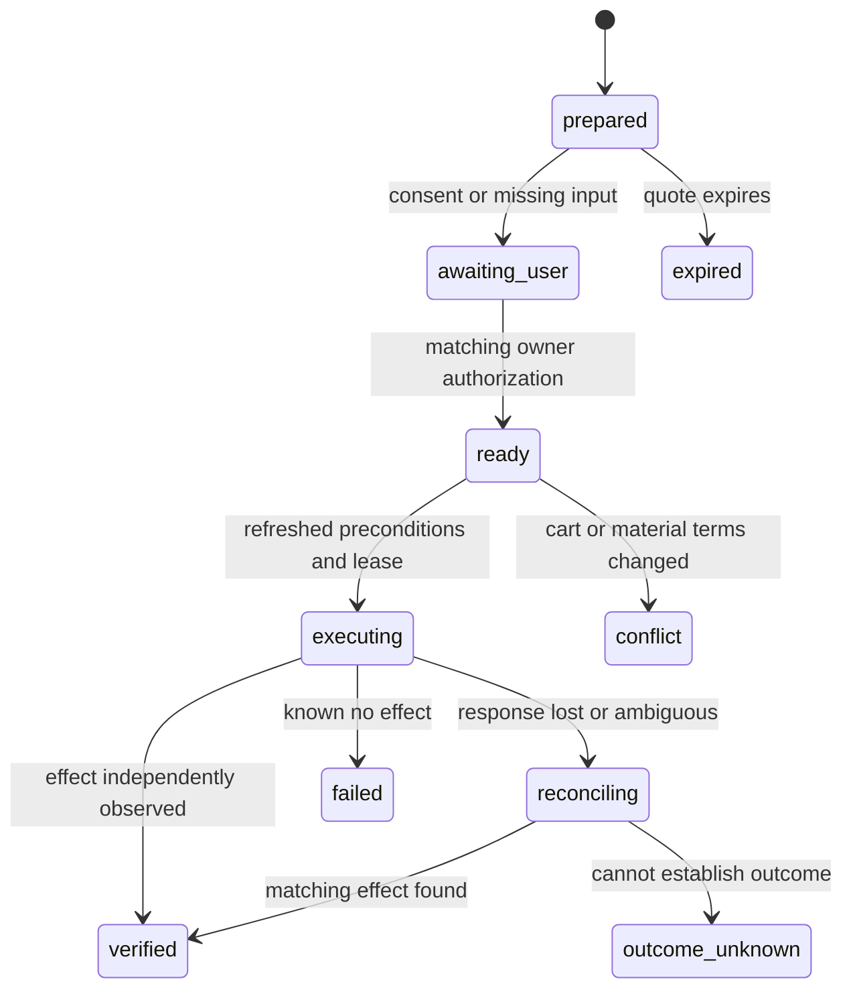

# Amazon consumer MCP: architecture proposal

Status: proposed, 2026-09-20. Scope and user preferences are recorded in [requirements.md](requirements.md). Detailed provider evidence is in [research/](research/). No application code, credentials, deployment or Amazon account actions have been created.

## Decision

Use Vercel's `mcp-handler` as a thin HTTP adapter around a transport-independent TypeScript application. Keep authenticated browser execution in a persistent worker. Begin with one personal Amazon.com account, optional paid enrichment and explicit feature coverage. Browser-dependent capabilities are conditional on an acceptable access path and demonstrated account-flow reliability; the existence of a browser library does not establish either.

The same application can run entirely on the user's machine or put the gateway on Vercel. Choosing Vercel's framework does not require running an Amazon browser inside a serverless request. The framework is replaceable without changing shopping, account or operation logic.

The current [mcp-handler repository](https://github.com/vercel-labs/mcp-handler) describes SDK v2 integration and compatibility with the newer and older protocol generations. Pin published compatible versions only after a client interoperability spike. Do not copy older `@vercel/mcp-adapter`, Redis/SSE or SDK v1 examples into a new project. See [MCP platform research](research/mcp-platform.md) for registry and release evidence.

## Components



The diagram describes logical boundaries. At personal scale there are two deployable processes, gateway and worker, plus Postgres; domain/provider packages are libraries. No microservice mesh, separate vector database, autonomous shopping agent or LLM service is needed for the core.

## Deployment options

| | Local | Hosted | Hybrid |
| --- | --- | --- | --- |
| Gateway | Local Node/Next.js with `mcp-handler` | Vercel or another Node host | Vercel |
| Browser worker | Dedicated local browser/profile | Persistent container with browser; managed browser optional | Dedicated local browser/profile |
| State | Local Postgres | Hosted Postgres | Hosted Postgres with minimized/encrypted account data |
| Sign-in / MFA | User completes in visible local browser | Secure interactive browser handoff | User completes locally |
| Available while Mac sleeps | No | Yes, subject to hosted session health | Public API reads may work; authenticated work queues until worker returns |
| Cash cost | No required paid API; local resource use | Compute/database hosting; managed browser optional and extra | Gateway/database hosting, potentially within quotas |
| Main advantage | Session stays on user's machine; easiest account control | Continuous monitoring and remote-client access | Remote MCP endpoint with local session custody |
| Main limitation | Local-client reachability and uptime | Remote session custody, operating cost, more complex account challenges | Split-system complexity without continuous Amazon access |

Recommended starting point: local gateway and worker for the feasibility spike, because it proves the account flows without a browser vendor commitment. Keep deployment configuration portable and present hosted operation as a tested second profile if always-on monitoring matters. This is a recommendation, not a settled user decision.

A local HTTP server binds to loopback and validates its caller and origin. Do not expose it via a public tunnel by default. Hybrid workers connect outbound to the state/dispatch service using a scoped worker credential; never expose browser debugging ports. Hosted browsers use per-account persistent storage and owner-only remote interaction.

## Proposed implementation stack

| Concern | Choice / constraint |
| --- | --- |
| Language and workspace | TypeScript, supported Node LTS >=22, pnpm workspace |
| MCP | Published compatible `mcp-handler` and official MCP server SDK, Zod schemas |
| Gateway and small owner UI | Next.js Node runtime; UI limited to connection/session state, action summaries and private artifacts |
| Browser | Direct Playwright library; dedicated persistent profile; no generic browser MCP exposed to consumers |
| Persistence | Postgres, SQL migrations and one typed query layer; timestamps in UTC and money in integer minor units |
| Jobs and scheduled watches | Graphile Worker as the sole Postgres-backed queue/scheduler; verified 0.18.0 release, MIT, Node >=22; pin and test current compatibility in stage 0 |
| History | Own timestamped observations from permitted sources from first use; optional Keepa adapter for older historical data |
| Official catalogue | Creators API disabled by default; only enable if actual eligibility, deployment and intended use fit its restrictions |
| Tests | Schema/contract tests, fixture extraction tests and targeted Playwright workflows; live account checks separate and opt-in |
| Observability | Structured redacted logs, OpenTelemetry-compatible traces, operation/audit records, dependency update automation |

A maintained SDK is preferred when it fits. A small typed client against documented HTTP endpoints is preferable to adopting an unmaintained wrapper. Record provider terms, retention constraints and license in the adapter manifest. Do not claim that free/open-source code makes Amazon or a hosted service free or grants API access.

Avoid two workflow engines. Vercel Workflow or another durable service can replace the scheduler adapter later, but is not required for a personal server. A queue's retry guarantee never makes a browser purchase idempotent.

Research-verified starting versions are `mcp-handler` 2.2.0, official MCP server SDK 2.0.0, Playwright 1.63.0 and Graphile Worker 0.18.0. They are candidates to lock after interoperability tests, not installed dependencies. [Graphile Worker](https://github.com/graphile/worker) provides named queues, retries and scheduling; the application operation journal remains authoritative and browser side effects never rely on queue delivery alone.

## Package and ownership boundaries

```text
apps/gateway/                  MCP route, owner UI, auth callbacks, health
apps/worker/                   job runner, scheduler, browser lifecycle
packages/contracts/            schemas, domain identifiers, errors, result envelopes
packages/core/                 use cases, provider ports, routing, policies
packages/store/                migrations, repositories, operation journal, outbox
packages/browser-runtime/      profile/session lifecycle, page leases, handoff
packages/providers/amazon-web/
  discovery/                   search, categories, products, variants, related
  offers/                      offers, seller profile/feedback, delivery/return terms
  reviews/                     review pages, ratings, customer media
  deals/                       events, deals, coupons
  cart/                        active cart, saved items, reconciliation
  checkout/                    options, quotes, submission/reconciliation
  orders/                      history, detail, documents, tracking
  returns/                     eligibility, preparation, return lifecycle
  subscriptions/               recurring purchase lifecycle
packages/providers/keepa/      optional history and public enrichment
packages/providers/creators/   optional eligible catalogue integration
packages/notifications/        watches, change detection, channels
packages/testing/              redacted fixtures, fake providers, contract harness
docs/                         decisions, capabilities, operating instructions
```

The manager owns root configuration, shared contracts, registry wiring, database migrations and integration. Workers own one bounded path and its tests. Shared contract changes are proposals to the manager, not opportunistic cross-lane edits.

## Provider boundary and source authority

Each provider implements explicit ports such as `CatalogReader`, `OfferReader`, `AccountReader`, `CartMutator`, `CheckoutExecutor`, `OrderActionExecutor`, `HistoryReader` and `ShipmentReader`. A capability manifest describes supported marketplaces, account requirements, operation types, costs and known limits. There is no generic `execute_arbitrary_action` port.

Suggested source policy:

1. Authenticated Amazon view is authoritative for the user's cart, eligibility, order status and final checkout terms.
2. Public supported APIs can enrich discovery, product details and history; their offer observations do not authorize a transaction.
3. Own observations provide forward price history. Keepa, if enabled, provides an independently timestamped historical dataset.
4. Provider disagreement stays visible with source/time/context. Do not blend prices into a fictitious single quote.

A provider can return partial data. A result declares which fields/pages were observed and why the rest is missing. API responses and scraped page content are untrusted data and never instructions for the assistant or worker.

Cache personalized observations by owner, account/session context, marketplace, delivery context, source, variant and offer mode. Public product identifiers alone cannot key personalized prices or resource snapshots. Enforce ownership on delivery/context references even on catalogue tools. Retention is provider-specific; never use a short-lived licensed catalogue cache as a permanent historical-price archive.

## Core entities

| Entity | Key fields and distinctions |
| --- | --- |
| AccountContext | Owner, account handle, marketplace, locale, currency, masked delivery context, session state, membership observations |
| Product / Variant | Marketplace + ASIN, parent/child relation, attributes, identifiers, media |
| Offer | Product, seller, condition, fulfilment, mode, observed price/shipping, eligibility, observation time, opaque current offer reference |
| Seller | Marketplace + seller ID, profile, feedback periods/counts; independent of product reviews |
| Money / PriceSeries | Currency + minor units; series type, includes-shipping flag, coverage, timestamps and gaps |
| Cart / CartLine | Account, cart revision, selected state, exact variant/offer, quantity and purchase mode |
| CheckoutQuote | Selected lines, shipping groups, payment/address references, full totals, expiry and material-terms hash |
| Operation | Owner, kind, request identity, state, intent/consent, preconditions, attempts, observed effect, uncertainty |
| Order / OrderLine | Order identifier, original amounts, current line statuses, available actions and documents |
| Shipment / TrackingEvent | Shipment-to-line quantities, carrier reference, event history, original/current ETA, observed time |
| Return / Refund | Returned quantities, reason provided by user, method, fees, authorization, transit/refund milestones |
| Subscription | Product/variant, frequency, quantity, estimated next price, next date, cutoff and supported changes |
| Watch / Event / Delivery | Rule/cadence, observation version, semantic event, delivery attempts and acknowledgement |

Use opaque server-minted handles bound to the owner. Never accept an arbitrary path, browser-context identifier, database ID or foreign-account resource from a caller. An ASIN is not a globally unique key without marketplace context.

## Tool surface design

Use explicit tools grouped by domain, with read and write schemas clearly distinguished. Share generated schemas and result types between MCP handlers and service implementations. The proposed catalogue is in [tool-catalog.md](tool-catalog.md).

All operations produce an application envelope inside the MCP structured result:

```ts
type Result<T> = {
  status: 'ok' | 'partial' | 'pending' | 'requires_user_action'
    | 'unsupported' | 'conflict' | 'failed' | 'outcome_unknown';
  data?: T;
  observation?: { observedAt: string; source: string; contextRef: string };
  coverage?: { complete: boolean; missing: string[]; reason?: string };
  nextCursor?: string;
  operationId?: string;
  action?: { kind: string; url?: string; expiresAt?: string };
  error?: { code: string; retryable: boolean; retryAfterMs?: number };
};
```

This is an illustrative application type, not a replacement for the SDK's protocol envelope. Field-level sources accompany data when providers differ. Resource links hold lengthy review pages, time series and documents, with authorization on every read. Pagination tokens bind to query, context and source; a truncated page is never marked complete.

Read tools have truthful read-only annotations; mutating tools expose their risks and schemas. Annotations are hints, never authorization. Keep the exported tool registry deterministic; use an explicit capabilities tool for availability instead of changing tool names based on a transient browser session.

## Browser runtime

- One dedicated profile per Amazon account. Start/stop/reconnect explicitly and detect logged-out, challenge, consent, wrong-account, error and expected-page states.
- Default to semantic locators and deterministic domain operations. Extractors return validated data; action code checks the expected page and target before clicking.
- Serialize account writes. To avoid hidden cart/session side effects, start with a single account-browser execution lane, then widen only proven independent reads. Public API requests may run concurrently.
- A single browser-owner actor enforces account leases and execution generations. Database fencing cannot fence Amazon: quiesce or terminate the old browser runtime before granting another actor access. If that cannot be established, quarantine account writes. Test a paused/stale worker resuming after lease expiry.
- Challenge or new authentication returns `requires_user_action` with an owner-bound resume handle. The user signs in directly with Amazon. Suspend automation during human handoff; revalidate identity/session generation and take a fresh snapshot before resuming. Do not collect passwords, OTPs or cookies through MCP tools.
- If extraction fails, capture a minimized redacted diagnostic artifact, classify the page and stop the operation. A changed layout must not turn a missing price into zero or a missing button into a successful action.
- Stagehand or similar assistive extraction can be evaluated later. Do not put an open-ended LLM browser loop in charge of purchase/return execution.
- No CAPTCHA bypass, stealth escalation, proxy rotation or undocumented mobile/private Amazon API reverse engineering in the proposed implementation.

Amazon.com's current [Conditions of Use](https://digprjsurvey.amazon.com/csad/help/node/GLSBYFE9MGKKQXXM) restrict automated extraction and require transparent agent identification. Configure `Agent/AmazonShoppingMCP` consistently wherever agent requests are made. Identification is not permission for the requested extraction; stage 0 records the access basis and limits before activating each source. A blocked or unsupported path remains a handoff, not a stealth fallback.

The [Associates policies](https://affiliate-program.amazon.com/help/operating/policies) separately restrict installed-client use, self-purchases via affiliate links and price tracking/alerts. Consequently, Creators is disabled by default and excluded from the personal checkout/history paths. An eligible credential alone does not resolve the deployment or use restrictions. The default architecture does not require it.

## Mutation and consent model

Reversible user-requested cart edits execute and verify directly. Financial, recurring, destructive or publishing operations prepare a specific intent and execute against its authorized terms. The default consent surface is an authenticated owner review page; a host consent integration is acceptable only with a verified trust contract. A generic tool-approval prompt, model-supplied `approved: true` or ordinary tool input is not independently attested consent.



The operation journal records a server-issued immutable intent before dispatch. A single-use consent receipt is consumed atomically into exactly one operation for that intent, independent of caller idempotency keys. A new key cannot reuse authorization or bypass an existing operation. Calls also carry an owner-scoped idempotency key; reusing it with different arguments returns a conflict. A transaction and outbox make internal intent/job/event creation atomic. External browser effects cannot be made exactly-once by a database transaction.

After ambiguous consequential dispatch, quarantine account writes and reconcile using observed provider action/order identifiers and the pre/post baseline. Matching items/price/time alone is insufficient because the user could independently buy the same items. Missing order history after a wait is not proof of failure. `failed` with no effect requires a pre-dispatch rejection or authoritative evidence; otherwise preserve `outcome_unknown`, including partial results for split/compound actions. A fresh request/key cannot clear quarantine.

For checkout, authorization binds owner/account/session generation, exact seller/variant/quantity, recurring terms, currency/total, immutable destination/payment references and shipment terms. The UI shows masked labels, but those labels are not identity keys. Immediately before submission, re-read material state and compare; changed terms invalidate the proposal. Refund/replacement intents also bind any immediate replacement order and contingent charge if the original is not returned by its deadline.

Tests of real purchases, cancellations, returns or subscription changes require explicit user intent for those actual operations. Development fixtures and simulations never claim to prove production side effects.

## Authentication and private data

MCP authorization protects this server; Amazon authentication protects the browser session. Login with Amazon or a catalogue API token is not automatically authority to read the user's Amazon orders. Keep these credentials and identities separate.

Remote mode uses a maintained OAuth/OIDC authorization service with audience/issuer/expiry/scope validation and protected-resource metadata. Suggested scopes: `catalog:read`, `account:read`, `cart:write`, `checkout:prepare`, `checkout:commit`, `orders:write`, `subscriptions:write`, `watches:write`. Local development still authenticates requests; it does not create an unauthenticated LAN endpoint.

Cookies, password flows, card numbers and raw authentication pages are never model output. Store encryption keys in the OS secret store or managed secret service. The profile remains on encrypted local storage or an encrypted dedicated hosted volume. Turn off traces, screenshots, network-body capture and vendor session replay during login, MFA, payment entry and recovery; redacting after capture is insufficient. Hosted activation verifies those controls. Elsewhere diagnostics are minimal, allowlisted, owner-only and subject to short retention/deletion. Document URLs expire and are not public CDN assets.

Restrict Amazon navigation to configured marketplace and verified redirect domains. Validate media/document fetches separately, including redirect and private-network protections. Page text, reviews, seller policies and product descriptions cannot change scope, target account, approved operation or notification destination.

## Durable work and proactive updates

Long account reads and writes return an operation handle when they exceed the synchronous budget. The baseline client polls `operations_get`; native MCP Tasks can be layered on where the selected SDK and host actually support them. Internal jobs survive gateway restarts and do not depend on an open MCP connection.

Watches use scheduled jobs with a bounded cadence, per-account throttling and source-aware freshness. Compare structured observations and write an event with its occurrence/revision identity; a later A→B→A transition or second threshold crossing must not be suppressed as an old duplicate. Deliver through an outbox. Notification retries have separate identities from the event. Quiet hours and cooldowns delay delivery without losing the state change.

The [2026-07-28 MCP changes](https://modelcontextprotocol.io/specification/2026-07-28/changelog) introduce a different subscription model and move tasks to an extension. Treat protocol subscriptions as optional connected-client delivery, not a portable OS notification service. The event inbox works everywhere; desktop/Web Push delivery needs its own configured channel. A shipping change cannot silently authorize a purchase, return or message.

## Reliability, tests and rollout gates

1. Contract tests validate schemas, ownership, money, pagination and capability errors without a browser.
2. Redacted fixture tests exercise known Amazon layouts and adversarial/missing data. Cover wrong variant, same-ASIN multiple sellers, multi-page reviews, discounts with conditions, split shipments and unavailable actions.
3. Domain tests cover state machines, stale quote/cart conflicts, duplicate requests, worker lease loss and the lost-response-after-click case.
4. Browser smoke tests confirm current page shape and account identity through read-only scenarios. Keep rate-limited live checks separate from normal CI.
5. MCP integration tests cover discovery/auth/results and selected clients; verify any advertised task/elicitation/notification behavior in each client.
6. A per-feature capability ledger records implementation, fixture test, live read verification and authorized live mutation verification separately. A simulated checkout is not labelled production-verified.

Initial engineering targets, to validate in the feasibility spike: cached lookups within a few seconds; browser reads show progress or a job handle within a short bounded request; watches have an explicit cadence and recorded lag. Avoid invented uptime or latency guarantees for Amazon-controlled pages.

Dependency checks record published versions, release dates, licenses and compatibility at implementation time. Pin versions; use automated update PRs and smoke tests before upgrades. Review browser extraction drift through failing health checks, not by blindly retrying more aggressively.

## Main limits and open decisions

The largest uncertainty is authenticated Amazon workflow reliability and permitted access, not MCP routing. Current retail terms restrict the extraction involved, so a technically successful browser demonstration alone is insufficient to establish a supported full-feature implementation. Browser availability, layout/challenge changes, account-specific eligibility and incomplete review/history data remain external constraints. Detailed evidence and product boundaries appear in the research reports.

The plan keeps paid enrichment optional, does not assume affiliate eligibility and does not promise historical data from before observations began. Hosted operation improves uptime but adds session custody and cost. Select deployment after the local feasibility evidence and decide the first notification client/channel before promising proactive prompts.
